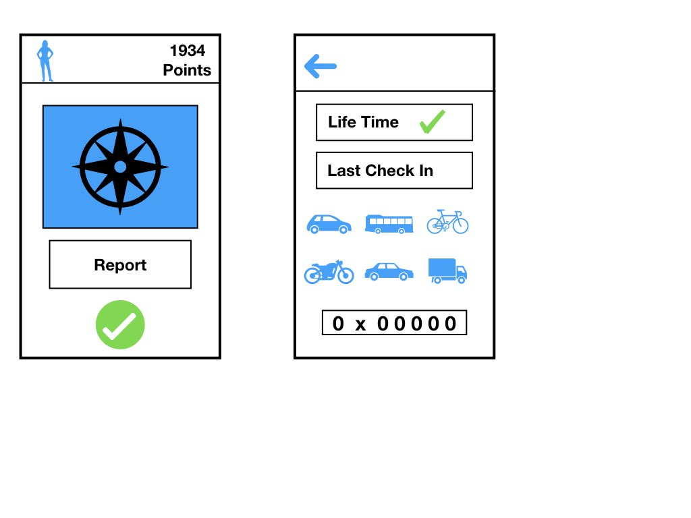

# blocksaver

token contract address:
* 0xD3724b06f9b16373d714a88adCc0289389aB3869


crowdsale contract addres:
* 0xc5c20468e91A513e5cb405F87e65bCD2e20125B3




<h1> Crowdsale ABI </h1>
```
[
	{
		"constant": false,
		"inputs": [],
		"name": "checkGoalReached",
		"outputs": [],
		"payable": false,
		"stateMutability": "nonpayable",
		"type": "function"
	},
	{
		"constant": true,
		"inputs": [],
		"name": "deadline",
		"outputs": [
			{
				"name": "",
				"type": "uint256"
			}
		],
		"payable": false,
		"stateMutability": "view",
		"type": "function"
	},
	{
		"constant": true,
		"inputs": [],
		"name": "beneficiary",
		"outputs": [
			{
				"name": "",
				"type": "address"
			}
		],
		"payable": false,
		"stateMutability": "view",
		"type": "function"
	},
	{
		"constant": false,
		"inputs": [
			{
				"name": "_value",
				"type": "string"
			},
			{
				"name": "_message",
				"type": "string"
			}
		],
		"name": "checkIn",
		"outputs": [],
		"payable": false,
		"stateMutability": "nonpayable",
		"type": "function"
	},
	{
		"constant": true,
		"inputs": [],
		"name": "tokenReward",
		"outputs": [
			{
				"name": "",
				"type": "address"
			}
		],
		"payable": false,
		"stateMutability": "view",
		"type": "function"
	},
	{
		"constant": true,
		"inputs": [
			{
				"name": "",
				"type": "address"
			}
		],
		"name": "balanceOf",
		"outputs": [
			{
				"name": "",
				"type": "uint256"
			}
		],
		"payable": false,
		"stateMutability": "view",
		"type": "function"
	},
	{
		"constant": true,
		"inputs": [],
		"name": "fundingGoal",
		"outputs": [
			{
				"name": "",
				"type": "uint256"
			}
		],
		"payable": false,
		"stateMutability": "view",
		"type": "function"
	},
	{
		"constant": true,
		"inputs": [],
		"name": "amountRaised",
		"outputs": [
			{
				"name": "",
				"type": "uint256"
			}
		],
		"payable": false,
		"stateMutability": "view",
		"type": "function"
	},
	{
		"constant": true,
		"inputs": [],
		"name": "price",
		"outputs": [
			{
				"name": "",
				"type": "uint256"
			}
		],
		"payable": false,
		"stateMutability": "view",
		"type": "function"
	},
	{
		"constant": false,
		"inputs": [],
		"name": "safeWithdrawal",
		"outputs": [],
		"payable": false,
		"stateMutability": "nonpayable",
		"type": "function"
	},
	{
		"inputs": [
			{
				"name": "ifSuccessfulSendTo",
				"type": "address"
			},
			{
				"name": "fundingGoalInEthers",
				"type": "uint256"
			},
			{
				"name": "durationInMinutes",
				"type": "uint256"
			},
			{
				"name": "etherCostOfEachToken",
				"type": "uint256"
			},
			{
				"name": "addressOfTokenUsedAsReward",
				"type": "address"
			}
		],
		"payable": false,
		"stateMutability": "nonpayable",
		"type": "constructor"
	},
	{
		"payable": true,
		"stateMutability": "payable",
		"type": "fallback"
	},
	{
		"anonymous": false,
		"inputs": [
			{
				"indexed": false,
				"name": "recipient",
				"type": "address"
			},
			{
				"indexed": false,
				"name": "totalAmountRaised",
				"type": "uint256"
			}
		],
		"name": "GoalReached",
		"type": "event"
	},
	{
		"anonymous": false,
		"inputs": [
			{
				"indexed": false,
				"name": "backer",
				"type": "address"
			},
			{
				"indexed": false,
				"name": "_value",
				"type": "string"
			},
			{
				"indexed": false,
				"name": "_message",
				"type": "string"
			}
		],
		"name": "FundTransfer",
		"type": "event"
	}
]
```
<h1> Crowdsale ByteCode </h1>
```
{
	"linkReferences": {},
	"object": "60806040526000600760006101000a81548160ff0219169083151502179055506000600760016101000a81548160ff02191690831515021790555034801561004657600080fd5b5060405160a080610bc08339810180604052810190808051906020019092919080519060200190929190805190602001909291908051906020019092919080519060200190929190505050846000806101000a81548173ffffffffffffffffffffffffffffffffffffffff021916908373ffffffffffffffffffffffffffffffffffffffff160217905550670de0b6b3a76400008402600181905550603c83024201600381905550670de0b6b3a7640000820260048190555080600560006101000a81548173ffffffffffffffffffffffffffffffffffffffff021916908373ffffffffffffffffffffffffffffffffffffffff1602179055505050505050610a6c806101546000396000f3006080604052600436106100a4576000357c0100000000000000000000000000000000000000000000000000000000900463ffffffff16806301cb3b201461020f57806329dcb0cf1461022657806338af3eed146102515780633b60e346146102a85780636e66f6e91461035757806370a08231146103ae5780637a3a0e84146104055780637b3e5e7b14610430578063a035b1fe1461045b578063fd6b7ef814610486575b6000600760019054906101000a900460ff161515156100c257600080fd5b34905080600660003373ffffffffffffffffffffffffffffffffffffffff1673ffffffffffffffffffffffffffffffffffffffff1681526020019081526020016000206000828254019250508190555080600260008282540192505081905550600560009054906101000a900473ffffffffffffffffffffffffffffffffffffffff1673ffffffffffffffffffffffffffffffffffffffff1663a9059cbb336004548481151561016e57fe5b046040518363ffffffff167c0100000000000000000000000000000000000000000000000000000000028152600401808373ffffffffffffffffffffffffffffffffffffffff1673ffffffffffffffffffffffffffffffffffffffff16815260200182815260200192505050600060405180830381600087803b1580156101f457600080fd5b505af1158015610208573d6000803e3d6000fd5b5050505050005b34801561021b57600080fd5b5061022461049d565b005b34801561023257600080fd5b5061023b61057d565b6040518082815260200191505060405180910390f35b34801561025d57600080fd5b50610266610583565b604051808273ffffffffffffffffffffffffffffffffffffffff1673ffffffffffffffffffffffffffffffffffffffff16815260200191505060405180910390f35b3480156102b457600080fd5b50610355600480360381019080803590602001908201803590602001908080601f0160208091040260200160405190810160405280939291908181526020018383808284378201915050505050509192919290803590602001908201803590602001908080601f01602080910402602001604051908101604052809392919081815260200183838082843782019150505050505091929192905050506105a8565b005b34801561036357600080fd5b5061036c6107c7565b604051808273ffffffffffffffffffffffffffffffffffffffff1673ffffffffffffffffffffffffffffffffffffffff16815260200191505060405180910390f35b3480156103ba57600080fd5b506103ef600480360381019080803573ffffffffffffffffffffffffffffffffffffffff1690602001909291905050506107ed565b6040518082815260200191505060405180910390f35b34801561041157600080fd5b5061041a610805565b6040518082815260200191505060405180910390f35b34801561043c57600080fd5b5061044561080b565b6040518082815260200191505060405180910390f35b34801561046757600080fd5b50610470610811565b6040518082815260200191505060405180910390f35b34801561049257600080fd5b5061049b610817565b005b6003544210151561057b5760015460025410151561055f576001600760006101000a81548160ff0219169083151502179055507fec3f991caf7857d61663fd1bba1739e04abd4781238508cde554bb849d790c856000809054906101000a900473ffffffffffffffffffffffffffffffffffffffff16600254604051808373ffffffffffffffffffffffffffffffffffffffff1673ffffffffffffffffffffffffffffffffffffffff1681526020018281526020019250505060405180910390a15b6001600760016101000a81548160ff0219169083151502179055505b565b60035481565b6000809054906101000a900473ffffffffffffffffffffffffffffffffffffffff1681565b600560009054906101000a900473ffffffffffffffffffffffffffffffffffffffff1673ffffffffffffffffffffffffffffffffffffffff1663a9059cbb3360016040518363ffffffff167c0100000000000000000000000000000000000000000000000000000000028152600401808373ffffffffffffffffffffffffffffffffffffffff1673ffffffffffffffffffffffffffffffffffffffff16815260200182815260200192505050600060405180830381600087803b15801561066e57600080fd5b505af1158015610682573d6000803e3d6000fd5b505050507f514bc3d03e5c7b9f94eccb47fa37107c4934d7ea10ded0106522290dd6a937d8338383604051808473ffffffffffffffffffffffffffffffffffffffff1673ffffffffffffffffffffffffffffffffffffffff1681526020018060200180602001838103835285818151815260200191508051906020019080838360005b83811015610720578082015181840152602081019050610705565b50505050905090810190601f16801561074d5780820380516001836020036101000a031916815260200191505b50838103825284818151815260200191508051906020019080838360005b8381101561078657808201518184015260208101905061076b565b50505050905090810190601f1680156107b35780820380516001836020036101000a031916815260200191505b509550505050505060405180910390a15050565b600560009054906101000a900473ffffffffffffffffffffffffffffffffffffffff1681565b60066020528060005260406000206000915090505481565b60015481565b60025481565b60045481565b600060035442101515610a3d57600760009054906101000a900460ff16151561095057600660003373ffffffffffffffffffffffffffffffffffffffff1673ffffffffffffffffffffffffffffffffffffffff1681526020019081526020016000205490506000600660003373ffffffffffffffffffffffffffffffffffffffff1673ffffffffffffffffffffffffffffffffffffffff16815260200190815260200160002081905550600081111561094f573373ffffffffffffffffffffffffffffffffffffffff166108fc829081150290604051600060405180830381858888f19350505050156109095761094e565b80600660003373ffffffffffffffffffffffffffffffffffffffff1673ffffffffffffffffffffffffffffffffffffffff168152602001908152602001600020819055505b5b5b600760009054906101000a900460ff1680156109b857503373ffffffffffffffffffffffffffffffffffffffff166000809054906101000a900473ffffffffffffffffffffffffffffffffffffffff1673ffffffffffffffffffffffffffffffffffffffff16145b15610a3c576000809054906101000a900473ffffffffffffffffffffffffffffffffffffffff1673ffffffffffffffffffffffffffffffffffffffff166108fc6002549081150290604051600060405180830381858888f1935050505015610a1f57610a3b565b6000600760006101000a81548160ff0219169083151502179055505b5b5b505600a165627a7a72305820dc81c5058f93f31dd714c45221e31ca9980548ab865525f4857fd92aad22273c0029",
	"opcodes": "PUSH1 0x80 PUSH1 0x40 MSTORE PUSH1 0x0 PUSH1 0x7 PUSH1 0x0 PUSH2 0x100 EXP DUP2 SLOAD DUP2 PUSH1 0xFF MUL NOT AND SWAP1 DUP4 ISZERO ISZERO MUL OR SWAP1 SSTORE POP PUSH1 0x0 PUSH1 0x7 PUSH1 0x1 PUSH2 0x100 EXP DUP2 SLOAD DUP2 PUSH1 0xFF MUL NOT AND SWAP1 DUP4 ISZERO ISZERO MUL OR SWAP1 SSTORE POP CALLVALUE DUP1 ISZERO PUSH2 0x46 JUMPI PUSH1 0x0 DUP1 REVERT JUMPDEST POP PUSH1 0x40 MLOAD PUSH1 0xA0 DUP1 PUSH2 0xBC0 DUP4 CODECOPY DUP2 ADD DUP1 PUSH1 0x40 MSTORE DUP2 ADD SWAP1 DUP1 DUP1 MLOAD SWAP1 PUSH1 0x20 ADD SWAP1 SWAP3 SWAP2 SWAP1 DUP1 MLOAD SWAP1 PUSH1 0x20 ADD SWAP1 SWAP3 SWAP2 SWAP1 DUP1 MLOAD SWAP1 PUSH1 0x20 ADD SWAP1 SWAP3 SWAP2 SWAP1 DUP1 MLOAD SWAP1 PUSH1 0x20 ADD SWAP1 SWAP3 SWAP2 SWAP1 DUP1 MLOAD SWAP1 PUSH1 0x20 ADD SWAP1 SWAP3 SWAP2 SWAP1 POP POP POP DUP5 PUSH1 0x0 DUP1 PUSH2 0x100 EXP DUP2 SLOAD DUP2 PUSH20 0xFFFFFFFFFFFFFFFFFFFFFFFFFFFFFFFFFFFFFFFF MUL NOT AND SWAP1 DUP4 PUSH20 0xFFFFFFFFFFFFFFFFFFFFFFFFFFFFFFFFFFFFFFFF AND MUL OR SWAP1 SSTORE POP PUSH8 0xDE0B6B3A7640000 DUP5 MUL PUSH1 0x1 DUP2 SWAP1 SSTORE POP PUSH1 0x3C DUP4 MUL TIMESTAMP ADD PUSH1 0x3 DUP2 SWAP1 SSTORE POP PUSH8 0xDE0B6B3A7640000 DUP3 MUL PUSH1 0x4 DUP2 SWAP1 SSTORE POP DUP1 PUSH1 0x5 PUSH1 0x0 PUSH2 0x100 EXP DUP2 SLOAD DUP2 PUSH20 0xFFFFFFFFFFFFFFFFFFFFFFFFFFFFFFFFFFFFFFFF MUL NOT AND SWAP1 DUP4 PUSH20 0xFFFFFFFFFFFFFFFFFFFFFFFFFFFFFFFFFFFFFFFF AND MUL OR SWAP1 SSTORE POP POP POP POP POP POP PUSH2 0xA6C DUP1 PUSH2 0x154 PUSH1 0x0 CODECOPY PUSH1 0x0 RETURN STOP PUSH1 0x80 PUSH1 0x40 MSTORE PUSH1 0x4 CALLDATASIZE LT PUSH2 0xA4 JUMPI PUSH1 0x0 CALLDATALOAD PUSH29 0x100000000000000000000000000000000000000000000000000000000 SWAP1 DIV PUSH4 0xFFFFFFFF AND DUP1 PUSH4 0x1CB3B20 EQ PUSH2 0x20F JUMPI DUP1 PUSH4 0x29DCB0CF EQ PUSH2 0x226 JUMPI DUP1 PUSH4 0x38AF3EED EQ PUSH2 0x251 JUMPI DUP1 PUSH4 0x3B60E346 EQ PUSH2 0x2A8 JUMPI DUP1 PUSH4 0x6E66F6E9 EQ PUSH2 0x357 JUMPI DUP1 PUSH4 0x70A08231 EQ PUSH2 0x3AE JUMPI DUP1 PUSH4 0x7A3A0E84 EQ PUSH2 0x405 JUMPI DUP1 PUSH4 0x7B3E5E7B EQ PUSH2 0x430 JUMPI DUP1 PUSH4 0xA035B1FE EQ PUSH2 0x45B JUMPI DUP1 PUSH4 0xFD6B7EF8 EQ PUSH2 0x486 JUMPI JUMPDEST PUSH1 0x0 PUSH1 0x7 PUSH1 0x1 SWAP1 SLOAD SWAP1 PUSH2 0x100 EXP SWAP1 DIV PUSH1 0xFF AND ISZERO ISZERO ISZERO PUSH2 0xC2 JUMPI PUSH1 0x0 DUP1 REVERT JUMPDEST CALLVALUE SWAP1 POP DUP1 PUSH1 0x6 PUSH1 0x0 CALLER PUSH20 0xFFFFFFFFFFFFFFFFFFFFFFFFFFFFFFFFFFFFFFFF AND PUSH20 0xFFFFFFFFFFFFFFFFFFFFFFFFFFFFFFFFFFFFFFFF AND DUP2 MSTORE PUSH1 0x20 ADD SWAP1 DUP2 MSTORE PUSH1 0x20 ADD PUSH1 0x0 KECCAK256 PUSH1 0x0 DUP3 DUP3 SLOAD ADD SWAP3 POP POP DUP2 SWAP1 SSTORE POP DUP1 PUSH1 0x2 PUSH1 0x0 DUP3 DUP3 SLOAD ADD SWAP3 POP POP DUP2 SWAP1 SSTORE POP PUSH1 0x5 PUSH1 0x0 SWAP1 SLOAD SWAP1 PUSH2 0x100 EXP SWAP1 DIV PUSH20 0xFFFFFFFFFFFFFFFFFFFFFFFFFFFFFFFFFFFFFFFF AND PUSH20 0xFFFFFFFFFFFFFFFFFFFFFFFFFFFFFFFFFFFFFFFF AND PUSH4 0xA9059CBB CALLER PUSH1 0x4 SLOAD DUP5 DUP2 ISZERO ISZERO PUSH2 0x16E JUMPI INVALID JUMPDEST DIV PUSH1 0x40 MLOAD DUP4 PUSH4 0xFFFFFFFF AND PUSH29 0x100000000000000000000000000000000000000000000000000000000 MUL DUP2 MSTORE PUSH1 0x4 ADD DUP1 DUP4 PUSH20 0xFFFFFFFFFFFFFFFFFFFFFFFFFFFFFFFFFFFFFFFF AND PUSH20 0xFFFFFFFFFFFFFFFFFFFFFFFFFFFFFFFFFFFFFFFF AND DUP2 MSTORE PUSH1 0x20 ADD DUP3 DUP2 MSTORE PUSH1 0x20 ADD SWAP3 POP POP POP PUSH1 0x0 PUSH1 0x40 MLOAD DUP1 DUP4 SUB DUP2 PUSH1 0x0 DUP8 DUP1 EXTCODESIZE ISZERO DUP1 ISZERO PUSH2 0x1F4 JUMPI PUSH1 0x0 DUP1 REVERT JUMPDEST POP GAS CALL ISZERO DUP1 ISZERO PUSH2 0x208 JUMPI RETURNDATASIZE PUSH1 0x0 DUP1 RETURNDATACOPY RETURNDATASIZE PUSH1 0x0 REVERT JUMPDEST POP POP POP POP POP STOP JUMPDEST CALLVALUE DUP1 ISZERO PUSH2 0x21B JUMPI PUSH1 0x0 DUP1 REVERT JUMPDEST POP PUSH2 0x224 PUSH2 0x49D JUMP JUMPDEST STOP JUMPDEST CALLVALUE DUP1 ISZERO PUSH2 0x232 JUMPI PUSH1 0x0 DUP1 REVERT JUMPDEST POP PUSH2 0x23B PUSH2 0x57D JUMP JUMPDEST PUSH1 0x40 MLOAD DUP1 DUP3 DUP2 MSTORE PUSH1 0x20 ADD SWAP2 POP POP PUSH1 0x40 MLOAD DUP1 SWAP2 SUB SWAP1 RETURN JUMPDEST CALLVALUE DUP1 ISZERO PUSH2 0x25D JUMPI PUSH1 0x0 DUP1 REVERT JUMPDEST POP PUSH2 0x266 PUSH2 0x583 JUMP JUMPDEST PUSH1 0x40 MLOAD DUP1 DUP3 PUSH20 0xFFFFFFFFFFFFFFFFFFFFFFFFFFFFFFFFFFFFFFFF AND PUSH20 0xFFFFFFFFFFFFFFFFFFFFFFFFFFFFFFFFFFFFFFFF AND DUP2 MSTORE PUSH1 0x20 ADD SWAP2 POP POP PUSH1 0x40 MLOAD DUP1 SWAP2 SUB SWAP1 RETURN JUMPDEST CALLVALUE DUP1 ISZERO PUSH2 0x2B4 JUMPI PUSH1 0x0 DUP1 REVERT JUMPDEST POP PUSH2 0x355 PUSH1 0x4 DUP1 CALLDATASIZE SUB DUP2 ADD SWAP1 DUP1 DUP1 CALLDATALOAD SWAP1 PUSH1 0x20 ADD SWAP1 DUP3 ADD DUP1 CALLDATALOAD SWAP1 PUSH1 0x20 ADD SWAP1 DUP1 DUP1 PUSH1 0x1F ADD PUSH1 0x20 DUP1 SWAP2 DIV MUL PUSH1 0x20 ADD PUSH1 0x40 MLOAD SWAP1 DUP2 ADD PUSH1 0x40 MSTORE DUP1 SWAP4 SWAP3 SWAP2 SWAP1 DUP2 DUP2 MSTORE PUSH1 0x20 ADD DUP4 DUP4 DUP1 DUP3 DUP5 CALLDATACOPY DUP3 ADD SWAP2 POP POP POP POP POP POP SWAP2 SWAP3 SWAP2 SWAP3 SWAP1 DUP1 CALLDATALOAD SWAP1 PUSH1 0x20 ADD SWAP1 DUP3 ADD DUP1 CALLDATALOAD SWAP1 PUSH1 0x20 ADD SWAP1 DUP1 DUP1 PUSH1 0x1F ADD PUSH1 0x20 DUP1 SWAP2 DIV MUL PUSH1 0x20 ADD PUSH1 0x40 MLOAD SWAP1 DUP2 ADD PUSH1 0x40 MSTORE DUP1 SWAP4 SWAP3 SWAP2 SWAP1 DUP2 DUP2 MSTORE PUSH1 0x20 ADD DUP4 DUP4 DUP1 DUP3 DUP5 CALLDATACOPY DUP3 ADD SWAP2 POP POP POP POP POP POP SWAP2 SWAP3 SWAP2 SWAP3 SWAP1 POP POP POP PUSH2 0x5A8 JUMP JUMPDEST STOP JUMPDEST CALLVALUE DUP1 ISZERO PUSH2 0x363 JUMPI PUSH1 0x0 DUP1 REVERT JUMPDEST POP PUSH2 0x36C PUSH2 0x7C7 JUMP JUMPDEST PUSH1 0x40 MLOAD DUP1 DUP3 PUSH20 0xFFFFFFFFFFFFFFFFFFFFFFFFFFFFFFFFFFFFFFFF AND PUSH20 0xFFFFFFFFFFFFFFFFFFFFFFFFFFFFFFFFFFFFFFFF AND DUP2 MSTORE PUSH1 0x20 ADD SWAP2 POP POP PUSH1 0x40 MLOAD DUP1 SWAP2 SUB SWAP1 RETURN JUMPDEST CALLVALUE DUP1 ISZERO PUSH2 0x3BA JUMPI PUSH1 0x0 DUP1 REVERT JUMPDEST POP PUSH2 0x3EF PUSH1 0x4 DUP1 CALLDATASIZE SUB DUP2 ADD SWAP1 DUP1 DUP1 CALLDATALOAD PUSH20 0xFFFFFFFFFFFFFFFFFFFFFFFFFFFFFFFFFFFFFFFF AND SWAP1 PUSH1 0x20 ADD SWAP1 SWAP3 SWAP2 SWAP1 POP POP POP PUSH2 0x7ED JUMP JUMPDEST PUSH1 0x40 MLOAD DUP1 DUP3 DUP2 MSTORE PUSH1 0x20 ADD SWAP2 POP POP PUSH1 0x40 MLOAD DUP1 SWAP2 SUB SWAP1 RETURN JUMPDEST CALLVALUE DUP1 ISZERO PUSH2 0x411 JUMPI PUSH1 0x0 DUP1 REVERT JUMPDEST POP PUSH2 0x41A PUSH2 0x805 JUMP JUMPDEST PUSH1 0x40 MLOAD DUP1 DUP3 DUP2 MSTORE PUSH1 0x20 ADD SWAP2 POP POP PUSH1 0x40 MLOAD DUP1 SWAP2 SUB SWAP1 RETURN JUMPDEST CALLVALUE DUP1 ISZERO PUSH2 0x43C JUMPI PUSH1 0x0 DUP1 REVERT JUMPDEST POP PUSH2 0x445 PUSH2 0x80B JUMP JUMPDEST PUSH1 0x40 MLOAD DUP1 DUP3 DUP2 MSTORE PUSH1 0x20 ADD SWAP2 POP POP PUSH1 0x40 MLOAD DUP1 SWAP2 SUB SWAP1 RETURN JUMPDEST CALLVALUE DUP1 ISZERO PUSH2 0x467 JUMPI PUSH1 0x0 DUP1 REVERT JUMPDEST POP PUSH2 0x470 PUSH2 0x811 JUMP JUMPDEST PUSH1 0x40 MLOAD DUP1 DUP3 DUP2 MSTORE PUSH1 0x20 ADD SWAP2 POP POP PUSH1 0x40 MLOAD DUP1 SWAP2 SUB SWAP1 RETURN JUMPDEST CALLVALUE DUP1 ISZERO PUSH2 0x492 JUMPI PUSH1 0x0 DUP1 REVERT JUMPDEST POP PUSH2 0x49B PUSH2 0x817 JUMP JUMPDEST STOP JUMPDEST PUSH1 0x3 SLOAD TIMESTAMP LT ISZERO ISZERO PUSH2 0x57B JUMPI PUSH1 0x1 SLOAD PUSH1 0x2 SLOAD LT ISZERO ISZERO PUSH2 0x55F JUMPI PUSH1 0x1 PUSH1 0x7 PUSH1 0x0 PUSH2 0x100 EXP DUP2 SLOAD DUP2 PUSH1 0xFF MUL NOT AND SWAP1 DUP4 ISZERO ISZERO MUL OR SWAP1 SSTORE POP PUSH32 0xEC3F991CAF7857D61663FD1BBA1739E04ABD4781238508CDE554BB849D790C85 PUSH1 0x0 DUP1 SWAP1 SLOAD SWAP1 PUSH2 0x100 EXP SWAP1 DIV PUSH20 0xFFFFFFFFFFFFFFFFFFFFFFFFFFFFFFFFFFFFFFFF AND PUSH1 0x2 SLOAD PUSH1 0x40 MLOAD DUP1 DUP4 PUSH20 0xFFFFFFFFFFFFFFFFFFFFFFFFFFFFFFFFFFFFFFFF AND PUSH20 0xFFFFFFFFFFFFFFFFFFFFFFFFFFFFFFFFFFFFFFFF AND DUP2 MSTORE PUSH1 0x20 ADD DUP3 DUP2 MSTORE PUSH1 0x20 ADD SWAP3 POP POP POP PUSH1 0x40 MLOAD DUP1 SWAP2 SUB SWAP1 LOG1 JUMPDEST PUSH1 0x1 PUSH1 0x7 PUSH1 0x1 PUSH2 0x100 EXP DUP2 SLOAD DUP2 PUSH1 0xFF MUL NOT AND SWAP1 DUP4 ISZERO ISZERO MUL OR SWAP1 SSTORE POP JUMPDEST JUMP JUMPDEST PUSH1 0x3 SLOAD DUP2 JUMP JUMPDEST PUSH1 0x0 DUP1 SWAP1 SLOAD SWAP1 PUSH2 0x100 EXP SWAP1 DIV PUSH20 0xFFFFFFFFFFFFFFFFFFFFFFFFFFFFFFFFFFFFFFFF AND DUP2 JUMP JUMPDEST PUSH1 0x5 PUSH1 0x0 SWAP1 SLOAD SWAP1 PUSH2 0x100 EXP SWAP1 DIV PUSH20 0xFFFFFFFFFFFFFFFFFFFFFFFFFFFFFFFFFFFFFFFF AND PUSH20 0xFFFFFFFFFFFFFFFFFFFFFFFFFFFFFFFFFFFFFFFF AND PUSH4 0xA9059CBB CALLER PUSH1 0x1 PUSH1 0x40 MLOAD DUP4 PUSH4 0xFFFFFFFF AND PUSH29 0x100000000000000000000000000000000000000000000000000000000 MUL DUP2 MSTORE PUSH1 0x4 ADD DUP1 DUP4 PUSH20 0xFFFFFFFFFFFFFFFFFFFFFFFFFFFFFFFFFFFFFFFF AND PUSH20 0xFFFFFFFFFFFFFFFFFFFFFFFFFFFFFFFFFFFFFFFF AND DUP2 MSTORE PUSH1 0x20 ADD DUP3 DUP2 MSTORE PUSH1 0x20 ADD SWAP3 POP POP POP PUSH1 0x0 PUSH1 0x40 MLOAD DUP1 DUP4 SUB DUP2 PUSH1 0x0 DUP8 DUP1 EXTCODESIZE ISZERO DUP1 ISZERO PUSH2 0x66E JUMPI PUSH1 0x0 DUP1 REVERT JUMPDEST POP GAS CALL ISZERO DUP1 ISZERO PUSH2 0x682 JUMPI RETURNDATASIZE PUSH1 0x0 DUP1 RETURNDATACOPY RETURNDATASIZE PUSH1 0x0 REVERT JUMPDEST POP POP POP POP PUSH32 0x514BC3D03E5C7B9F94ECCB47FA37107C4934D7EA10DED0106522290DD6A937D8 CALLER DUP4 DUP4 PUSH1 0x40 MLOAD DUP1 DUP5 PUSH20 0xFFFFFFFFFFFFFFFFFFFFFFFFFFFFFFFFFFFFFFFF AND PUSH20 0xFFFFFFFFFFFFFFFFFFFFFFFFFFFFFFFFFFFFFFFF AND DUP2 MSTORE PUSH1 0x20 ADD DUP1 PUSH1 0x20 ADD DUP1 PUSH1 0x20 ADD DUP4 DUP2 SUB DUP4 MSTORE DUP6 DUP2 DUP2 MLOAD DUP2 MSTORE PUSH1 0x20 ADD SWAP2 POP DUP1 MLOAD SWAP1 PUSH1 0x20 ADD SWAP1 DUP1 DUP4 DUP4 PUSH1 0x0 JUMPDEST DUP4 DUP2 LT ISZERO PUSH2 0x720 JUMPI DUP1 DUP3 ADD MLOAD DUP2 DUP5 ADD MSTORE PUSH1 0x20 DUP2 ADD SWAP1 POP PUSH2 0x705 JUMP JUMPDEST POP POP POP POP SWAP1 POP SWAP1 DUP2 ADD SWAP1 PUSH1 0x1F AND DUP1 ISZERO PUSH2 0x74D JUMPI DUP1 DUP3 SUB DUP1 MLOAD PUSH1 0x1 DUP4 PUSH1 0x20 SUB PUSH2 0x100 EXP SUB NOT AND DUP2 MSTORE PUSH1 0x20 ADD SWAP2 POP JUMPDEST POP DUP4 DUP2 SUB DUP3 MSTORE DUP5 DUP2 DUP2 MLOAD DUP2 MSTORE PUSH1 0x20 ADD SWAP2 POP DUP1 MLOAD SWAP1 PUSH1 0x20 ADD SWAP1 DUP1 DUP4 DUP4 PUSH1 0x0 JUMPDEST DUP4 DUP2 LT ISZERO PUSH2 0x786 JUMPI DUP1 DUP3 ADD MLOAD DUP2 DUP5 ADD MSTORE PUSH1 0x20 DUP2 ADD SWAP1 POP PUSH2 0x76B JUMP JUMPDEST POP POP POP POP SWAP1 POP SWAP1 DUP2 ADD SWAP1 PUSH1 0x1F AND DUP1 ISZERO PUSH2 0x7B3 JUMPI DUP1 DUP3 SUB DUP1 MLOAD PUSH1 0x1 DUP4 PUSH1 0x20 SUB PUSH2 0x100 EXP SUB NOT AND DUP2 MSTORE PUSH1 0x20 ADD SWAP2 POP JUMPDEST POP SWAP6 POP POP POP POP POP POP PUSH1 0x40 MLOAD DUP1 SWAP2 SUB SWAP1 LOG1 POP POP JUMP JUMPDEST PUSH1 0x5 PUSH1 0x0 SWAP1 SLOAD SWAP1 PUSH2 0x100 EXP SWAP1 DIV PUSH20 0xFFFFFFFFFFFFFFFFFFFFFFFFFFFFFFFFFFFFFFFF AND DUP2 JUMP JUMPDEST PUSH1 0x6 PUSH1 0x20 MSTORE DUP1 PUSH1 0x0 MSTORE PUSH1 0x40 PUSH1 0x0 KECCAK256 PUSH1 0x0 SWAP2 POP SWAP1 POP SLOAD DUP2 JUMP JUMPDEST PUSH1 0x1 SLOAD DUP2 JUMP JUMPDEST PUSH1 0x2 SLOAD DUP2 JUMP JUMPDEST PUSH1 0x4 SLOAD DUP2 JUMP JUMPDEST PUSH1 0x0 PUSH1 0x3 SLOAD TIMESTAMP LT ISZERO ISZERO PUSH2 0xA3D JUMPI PUSH1 0x7 PUSH1 0x0 SWAP1 SLOAD SWAP1 PUSH2 0x100 EXP SWAP1 DIV PUSH1 0xFF AND ISZERO ISZERO PUSH2 0x950 JUMPI PUSH1 0x6 PUSH1 0x0 CALLER PUSH20 0xFFFFFFFFFFFFFFFFFFFFFFFFFFFFFFFFFFFFFFFF AND PUSH20 0xFFFFFFFFFFFFFFFFFFFFFFFFFFFFFFFFFFFFFFFF AND DUP2 MSTORE PUSH1 0x20 ADD SWAP1 DUP2 MSTORE PUSH1 0x20 ADD PUSH1 0x0 KECCAK256 SLOAD SWAP1 POP PUSH1 0x0 PUSH1 0x6 PUSH1 0x0 CALLER PUSH20 0xFFFFFFFFFFFFFFFFFFFFFFFFFFFFFFFFFFFFFFFF AND PUSH20 0xFFFFFFFFFFFFFFFFFFFFFFFFFFFFFFFFFFFFFFFF AND DUP2 MSTORE PUSH1 0x20 ADD SWAP1 DUP2 MSTORE PUSH1 0x20 ADD PUSH1 0x0 KECCAK256 DUP2 SWAP1 SSTORE POP PUSH1 0x0 DUP2 GT ISZERO PUSH2 0x94F JUMPI CALLER PUSH20 0xFFFFFFFFFFFFFFFFFFFFFFFFFFFFFFFFFFFFFFFF AND PUSH2 0x8FC DUP3 SWAP1 DUP2 ISZERO MUL SWAP1 PUSH1 0x40 MLOAD PUSH1 0x0 PUSH1 0x40 MLOAD DUP1 DUP4 SUB DUP2 DUP6 DUP9 DUP9 CALL SWAP4 POP POP POP POP ISZERO PUSH2 0x909 JUMPI PUSH2 0x94E JUMP JUMPDEST DUP1 PUSH1 0x6 PUSH1 0x0 CALLER PUSH20 0xFFFFFFFFFFFFFFFFFFFFFFFFFFFFFFFFFFFFFFFF AND PUSH20 0xFFFFFFFFFFFFFFFFFFFFFFFFFFFFFFFFFFFFFFFF AND DUP2 MSTORE PUSH1 0x20 ADD SWAP1 DUP2 MSTORE PUSH1 0x20 ADD PUSH1 0x0 KECCAK256 DUP2 SWAP1 SSTORE POP JUMPDEST JUMPDEST JUMPDEST PUSH1 0x7 PUSH1 0x0 SWAP1 SLOAD SWAP1 PUSH2 0x100 EXP SWAP1 DIV PUSH1 0xFF AND DUP1 ISZERO PUSH2 0x9B8 JUMPI POP CALLER PUSH20 0xFFFFFFFFFFFFFFFFFFFFFFFFFFFFFFFFFFFFFFFF AND PUSH1 0x0 DUP1 SWAP1 SLOAD SWAP1 PUSH2 0x100 EXP SWAP1 DIV PUSH20 0xFFFFFFFFFFFFFFFFFFFFFFFFFFFFFFFFFFFFFFFF AND PUSH20 0xFFFFFFFFFFFFFFFFFFFFFFFFFFFFFFFFFFFFFFFF AND EQ JUMPDEST ISZERO PUSH2 0xA3C JUMPI PUSH1 0x0 DUP1 SWAP1 SLOAD SWAP1 PUSH2 0x100 EXP SWAP1 DIV PUSH20 0xFFFFFFFFFFFFFFFFFFFFFFFFFFFFFFFFFFFFFFFF AND PUSH20 0xFFFFFFFFFFFFFFFFFFFFFFFFFFFFFFFFFFFFFFFF AND PUSH2 0x8FC PUSH1 0x2 SLOAD SWAP1 DUP2 ISZERO MUL SWAP1 PUSH1 0x40 MLOAD PUSH1 0x0 PUSH1 0x40 MLOAD DUP1 DUP4 SUB DUP2 DUP6 DUP9 DUP9 CALL SWAP4 POP POP POP POP ISZERO PUSH2 0xA1F JUMPI PUSH2 0xA3B JUMP JUMPDEST PUSH1 0x0 PUSH1 0x7 PUSH1 0x0 PUSH2 0x100 EXP DUP2 SLOAD DUP2 PUSH1 0xFF MUL NOT AND SWAP1 DUP4 ISZERO ISZERO MUL OR SWAP1 SSTORE POP JUMPDEST JUMPDEST JUMPDEST POP JUMP STOP LOG1 PUSH6 0x627A7A723058 KECCAK256 0xdc DUP2 0xc5 SDIV DUP16 SWAP4 RETURN SAR 0xd7 EQ 0xc4 MSTORE 0x21 0xe3 SHR 0xa9 SWAP9 SDIV 0x48 0xab DUP7 SSTORE 0x25 DELEGATECALL DUP6 PUSH32 0xD92AAD22273C0029000000000000000000000000000000000000000000000000 ",
	"sourceMap": "110:2979:0:-;;;381:5;355:31;;;;;;;;;;;;;;;;;;;;415:5;392:28;;;;;;;;;;;;;;;;;;;;640:469;8:9:-1;5:2;;;30:1;27;20:12;5:2;640:469:0;;;;;;;;;;;;;;;;;;;;;;;;;;;;;;;;;;;;;;;;;;;;;;;;;;;;;;;;;;;;;;;;;870:18;856:11;;:32;;;;;;;;;;;;;;;;;;934:7;912:19;:29;898:11;:43;;;;988:9;968:17;:29;962:3;:35;951:8;:46;;;;1038:7;1015:20;:30;1007:5;:38;;;;1075:26;1055:11;;:47;;;;;;;;;;;;;;;;;;640:469;;;;;110:2979;;;;;;"
}
```
